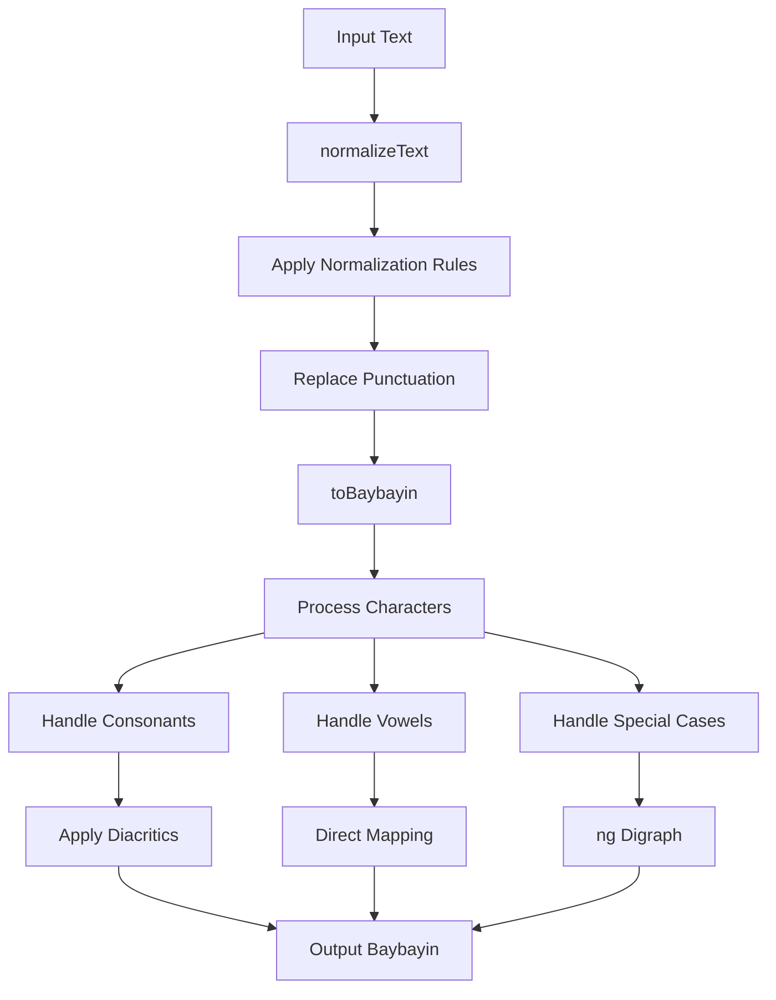

# Baybayin Transliterator - Developer Guide

## Table of Contents
- [Overview](#overview)
- [Project Structure](#project-structure)
- [Architecture](#architecture)
- [API Reference](#api-reference)
- [Development Setup](#development-setup)
- [Contributing](#contributing)
- [Testing](#testing)
- [Deployment](#deployment)

## Overview

The Baybayin Transliterator is a Node.js package that converts Latin text to Baybayin script, the ancient writing system of the Philippines. This package provides a modern TypeScript implementation with improved algorithms for accurate transliteration.

### Key Features
- **Text Normalization**: Converts modern Filipino text to phonetic equivalents
- **Baybayin Conversion**: Maps normalized text to Unicode Baybayin characters
- **Punctuation Support**: Handles common punctuation marks
- **TypeScript Support**: Full type definitions included
- **ES Module**: Modern module system support

### Version Information
- **Current Version**: 0.0.3 (TypeScript Migration)
- **License**: MIT
- **Author**: RyannKim327 (Ryann Kim Sesgundo)
- **Documentation**: Generated with Qodo AI

## Project Structure

```
Baybayin-Transliterator/
├── src/                    # Source code
│   ├── index.ts           # Main entry point
│   ├── functions.ts       # Core transliteration functions
│   ├── variables.ts       # Character mappings and rules
│   └── interfaces.ts      # TypeScript type definitions
├── docs/                  # Documentation
├── test.ts               # Test file
├── package.json          # Package configuration
├── tsconfig.json         # TypeScript configuration
├── LICENSE.md            # MIT License
└── ReadMe.md            # Basic usage guide
```

### File Descriptions

#### `src/index.ts`
Main entry point that exports the `baybay()` function. This function orchestrates the entire transliteration process.

#### `src/functions.ts`
Contains the core transliteration logic:
- `normalizeText()`: Applies phonetic normalization rules
- `toBaybayin()`: Converts normalized text to Baybayin characters

#### `src/variables.ts`
Defines character mappings and normalization rules:
- `BAYBAYIN_CHARACRERS`: Unicode mappings for Baybayin characters
- `NORMALIZED_RULES`: Text normalization patterns

#### `src/interfaces.ts`
TypeScript type definitions for the project's data structures.

## Architecture

### Data Flow



### Core Components

#### 1. Text Normalization
The normalization process converts modern Filipino text to a form that can be accurately represented in Baybayin:

- **Vowel Mapping**: `i` → `e`, `u` → `o`
- **Consonant Substitution**: `r` → `d`, `f` → `p`, `c/q` → `k`, `v` → `b`
- **Special Cases**: `mga` → `manga`, `j` → `dy`
- **Punctuation**: Maps to Baybayin punctuation marks

#### 2. Character Mapping
The system uses Unicode code points for Baybayin characters:

- **Consonants**: 13 basic consonants (5891-5905)
- **Vowels**: 3 independent vowels (5888-5890)
- **Diacritics**: Vowel markers (5906-5908)
- **Special**: `ng` digraph (5893)
- **Punctuation**: Period and comma equivalents (5941-5942)

#### 3. Transliteration Algorithm
The conversion process follows these steps:

1. **Character Iteration**: Process each character in the normalized text
2. **Digraph Detection**: Check for `ng` combinations first
3. **Consonant Processing**: Add consonant + appropriate vowel diacritic
4. **Vowel Processing**: Direct mapping for standalone vowels
5. **Fallback**: Preserve unrecognized characters

## API Reference

### Main Function

#### `baybay(text: string)`

Converts Latin text to Baybayin script.

**Parameters:**
- `text` (string): The input text to transliterate

**Returns:**
```typescript
{
  original: string;    // Original input text
  baybayin: string;     // Transliterated Baybayin text
}
```

**Example:**
```typescript
import baybay from 'baybayin-transliterator';

const result = baybay("Kamusta ka");
console.log(result.original); // "Kamusta ka"
console.log(result.baybayin);  // "ᜃᜋᜓᜐ᜔ᜆ ᜃ"
```

### Internal Functions

#### `normalizeText(input: string): string`

Applies normalization rules to prepare text for Baybayin conversion.

**Parameters:**
- `input` (string): Raw input text

**Returns:**
- `string`: Normalized text ready for conversion

#### `toBaybayin(text: string): string`

Converts normalized text to Baybayin characters.

**Parameters:**
- `text` (string): Normalized text

**Returns:**
- `string`: Baybayin script representation

### Type Definitions

```typescript
export type BAYBAYIN_LIST = Map<string, number | null>;
export type BAYBAYIN = Record<string, number | BAYBAYIN_LIST>;
export type NOMALIZED_TEXT = [RegExp, string];
```

## Development Setup

### Prerequisites
- Node.js (v16 or higher)
- npm or yarn
- TypeScript knowledge

### Installation

1. **Clone the repository:**
```bash
git clone https://github.com/RyannKim327/Baybayin-Transliterator.git
cd Baybayin-Transliterator
```

2. **Install dependencies:**
```bash
npm install
```

3. **Build the project:**
```bash
npx tsc
```

### Development Scripts

```bash
# Run tests
npm test

# Type checking
npx tsc --noEmit

# Run with tsx (development)
npx tsx test.ts
```

### Environment Setup

The project uses modern TypeScript configuration:
- **Target**: ESNext
- **Module**: NodeNext
- **Strict Mode**: Enabled
- **Source Maps**: Enabled for debugging

## Contributing

### Code Style Guidelines

1. **TypeScript**: Use strict typing, avoid `any`
2. **Naming**: Use camelCase for variables, PascalCase for types
3. **Comments**: Document complex algorithms and Unicode mappings
4. **Formatting**: Use tabs for indentation (project standard)

### Adding New Features

#### Adding New Characters

1. **Update `BAYBAYIN_CHARACRERS`** in `src/variables.ts`:
```typescript
consonants: new Map([
  // ... existing mappings
  ["newChar", unicodeCodePoint],
]),
```

2. **Add normalization rules** if needed:
```typescript
const NORMALIZED_RULES: NOMALIZED_TEXT[] = [
  // ... existing rules
  [/pattern/gi, "replacement"],
];
```

#### Adding New Normalization Rules

1. **Identify the pattern** that needs normalization
2. **Add to `NORMALIZED_RULES`** array
3. **Test thoroughly** with various inputs
4. **Update documentation**

### Testing Guidelines

1. **Test edge cases**: Empty strings, special characters, mixed scripts
2. **Verify Unicode output**: Ensure correct Baybayin characters
3. **Check normalization**: Verify rules work as expected
4. **Performance testing**: Test with long texts

## Testing

### Running Tests

```bash
# Basic test
npm test

# Custom test with tsx
npx tsx test.ts
```

### Test Cases to Consider

1. **Basic transliteration**: Simple words like "kamusta"
2. **Complex words**: Words with multiple syllables
3. **Punctuation**: Sentences with various punctuation marks
4. **Edge cases**: Empty strings, numbers, special characters
5. **Normalization**: Words requiring phonetic conversion

### Example Test Implementation

```typescript
import baybay from './src';

// Test cases
const testCases = [
  { input: "kamusta", expected: "ᜃᜋᜓᜐ᜔ᜆ" },
  { input: "mahal kita", expected: "ᜋᜑᜎ᜔ ᜃᜒᜆ" },
  { input: "salamat", expected: "ᜐᜎᜋᜆ᜔" },
];

testCases.forEach(({ input, expected }) => {
  const result = baybay(input);
  console.log(`Input: ${input}`);
  console.log(`Expected: ${expected}`);
  console.log(`Got: ${result.baybayin}`);
  console.log(`Match: ${result.baybayin === expected ? '✓' : '✗'}`);
  console.log('---');
});
```

## Deployment

### Publishing to NPM

1. **Update version** in `package.json`
2. **Build the project**:
```bash
npx tsc
```

3. **Test thoroughly**:
```bash
npm test
```

4. **Publish**:
```bash
npm publish
```

### Distribution Files

The package includes:
- **Source TypeScript files** (`src/`)
- **Type definitions** (generated by TypeScript)
- **Package metadata** (`package.json`)
- **License** (`LICENSE.md`)

### Usage in Other Projects

```bash
npm install baybayin-transliterator
```

```typescript
// ES Module
import baybay from 'baybayin-transliterator';

// CommonJS (if configured)
const baybay = require('baybayin-transliterator');
```

## Unicode Reference

### Baybayin Unicode Block (U+1700–U+171F)

| Character | Unicode | Description |
|-----------|---------|-------------|
| ᜀ | U+1700 | Vowel A |
| ᜁ | U+1701 | Vowel I/E |
| ᜂ | U+1702 | Vowel U/O |
| ᜃ | U+1703 | Consonant KA |
| ᜄ | U+1704 | Consonant GA |
| ᜅ | U+1705 | Consonant NGA |
| ᜆ | U+1706 | Consonant TA |
| ᜇ | U+1707 | Consonant DA |
| ᜈ | U+1708 | Consonant NA |
| ᜉ | U+1709 | Consonant PA |
| ᜊ | U+170A | Consonant BA |
| ᜋ | U+170B | Consonant MA |
| ᜌ | U+170C | Consonant YA |
| ᜍ | U+170D | Consonant RA |
| ᜎ | U+170E | Consonant LA |
| ᜏ | U+170F | Consonant WA |
| ᜐ | U+1710 | Consonant SA |
| ᜑ | U+1711 | Consonant HA |
| ᜒ | U+1712 | Vowel Sign I/E |
| ᜓ | U+1713 | Vowel Sign U/O |
| ᜔ | U+1714 | Sign Virama |
| ᜕ | U+1715 | Pamudpod |
| ᜖ | U+1716 | Stress Mark |

## Troubleshooting

### Common Issues

1. **Unicode Display**: Ensure your system supports Baybayin fonts
2. **Module Import**: Check that you're using the correct import syntax
3. **TypeScript Errors**: Verify TypeScript configuration matches project settings

### Performance Considerations

- The algorithm is O(n) where n is the length of input text
- Memory usage is minimal due to character-by-character processing
- Large texts (>10KB) should be processed in chunks for optimal performance

## Future Enhancements

### Planned Features
1. **Reverse transliteration**: Baybayin to Latin text
2. **Advanced normalization**: Better handling of Spanish loanwords
3. **Regional variants**: Support for different Baybayin styles
4. **Performance optimization**: Faster processing for large texts

### Contributing Ideas
- Improve accuracy of phonetic mappings
- Add support for more punctuation marks
- Implement syllable-aware processing
- Create comprehensive test suite
- Add CLI interface

---

For questions, issues, or contributions, please visit the [GitHub repository](https://github.com/RyannKim327/Baybayin-Transliterator) or contact the maintainer at weryses19@gmail.com.