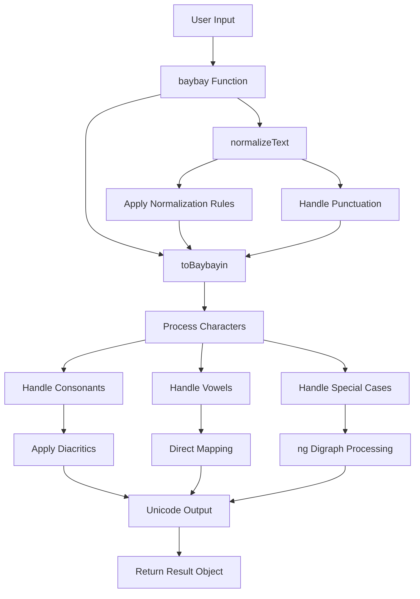

# Baybayin Transliterator Documentation

Welcome to the comprehensive documentation for the Baybayin Transliterator project. This documentation provides everything you need to understand, use, and contribute to this TypeScript/Node.js package for converting Latin text to Baybayin script.

## 📚 Documentation Overview

### For Users

- **[Quick Start Guide](../ReadMe.md)** - Basic usage and installation
- **[API Reference](API.md)** - Complete API documentation with examples
- **[Examples](#examples)** - Common usage patterns and integration examples

### For Developers

- **[Developer Guide](DEVELOPER_GUIDE.md)** - Comprehensive development documentation
- **[Contributing Guide](CONTRIBUTING.md)** - How to contribute to the project
- **[Architecture Overview](#architecture)** - System design and implementation details

### For Linguists and Cultural Researchers

- **[Baybayin Background](#baybayin-background)** - Historical and cultural context
- **[Transliteration Rules](#transliteration-rules)** - Detailed mapping rules and rationale
- **[Unicode Reference](#unicode-reference)** - Complete Unicode character mappings

## 🚀 Quick Navigation

| I want to... | Go to... |
|--------------|----------|
| Use the package in my project | [API Reference](API.md) |
| Understand how it works | [Developer Guide](DEVELOPER_GUIDE.md) |
| Contribute code | [Contributing Guide](CONTRIBUTING.md) |
| Report a bug | [GitHub Issues](https://github.com/RyannKim327/Baybayin-Transliterator/issues) |
| Learn about Baybayin | [Baybayin Background](#baybayin-background) |

## 📖 Examples

### Basic Usage

```typescript
import baybay from 'baybayin-transliterator';

// Simple transliteration
const result = baybay("Kamusta ka");
console.log(result.baybain); // ᜃᜋᜓᜐ᜔ᜆ ᜃ

// With punctuation
const greeting = baybay("Kumusta ka? Mabuti naman!");
console.log(greeting.baybain); // ᜃᜓᜋᜓᜐ᜔ᜆ ᜃ᜶ ᜋᜊᜓᜆᜒ ᜈᜋᜈ᜔᜶
```

### Web Application Integration

```html
<!DOCTYPE html>
<html>
<head>
    <meta charset="UTF-8">
    <title>Baybayin Translator</title>
    <style>
        .baybayin-output {
            font-family: 'Noto Sans Tagalog', serif;
            font-size: 24px;
            line-height: 1.5;
        }
    </style>
</head>
<body>
    <input type="text" id="input" placeholder="Enter text to translate">
    <button onclick="translate()">Translate</button>
    <div id="output" class="baybayin-output"></div>

    <script type="module">
        import baybay from './node_modules/baybayin-transliterator/index.js';
        
        window.translate = function() {
            const input = document.getElementById('input').value;
            const result = baybay(input);
            document.getElementById('output').textContent = result.baybain;
        };
    </script>
</body>
</html>
```

### Node.js CLI Tool

```typescript
#!/usr/bin/env node
import baybay from 'baybayin-transliterator';
import { readFileSync } from 'fs';

const args = process.argv.slice(2);

if (args.length === 0) {
    console.log('Usage: baybayin-cli <text> or baybayin-cli --file <filename>');
    process.exit(1);
}

if (args[0] === '--file') {
    const filename = args[1];
    const content = readFileSync(filename, 'utf-8');
    const result = baybay(content);
    console.log(result.baybain);
} else {
    const text = args.join(' ');
    const result = baybay(text);
    console.log(`Original: ${result.original}`);
    console.log(`Baybayin: ${result.baybain}`);
}
```

## 🏗️ Architecture

### System Overview



### Core Components

1. **Text Normalization** (`normalizeText`)
   - Applies phonetic rules to convert modern Filipino to Baybayin-compatible form
   - Handles Spanish loanwords and modern spelling variations

2. **Character Mapping** (`toBaybayin`)
   - Converts normalized text to Unicode Baybayin characters
   - Manages consonant-vowel combinations and diacritics

3. **Unicode Management** (`variables.ts`)
   - Maintains mappings between Latin characters and Unicode code points
   - Organizes character types (consonants, vowels, diacritics, punctuation)

## 📜 Baybayin Background

### Historical Context

Baybayin (also known as Alibata) is the ancient writing system of the Philippines, used primarily in the 16th century. It's an abugida script where consonants have an inherent vowel sound that can be modified with diacritical marks.

### Script Characteristics

- **Consonants**: 13 basic characters, each with inherent /a/ sound
- **Vowels**: 3 independent vowel characters
- **Diacritics**: Marks to change the vowel sound of consonants
- **Direction**: Traditionally written vertically, now often horizontal

### Modern Revival

The script has experienced a cultural revival in recent decades, with efforts to:
- Standardize Unicode representation
- Create modern fonts and digital tools
- Integrate into contemporary Filipino culture
- Preserve cultural heritage through technology

## 🔤 Transliteration Rules

### Phonetic Mappings

The transliteration follows these principles:

#### Vowel Simplification
- **i/e merger**: Both map to Baybayin 'e' (ᜁ)
- **u/o merger**: Both map to Baybayin 'o' (ᜂ)
- **Rationale**: Historical Baybayin didn't distinguish these vowel pairs

#### Consonant Adaptations
- **r → d**: No 'r' sound in traditional Baybayin
- **f → p**: Spanish influence, no native 'f' sound
- **c/q → k**: Phonetic equivalence
- **v → b**: No native 'v' sound
- **x/z → s**: Closest phonetic approximation

#### Special Cases
- **mga → manga**: Proper pronunciation representation
- **ng**: Special digraph character (ᜅ)
- **j → dy**: Closest traditional equivalent

### Diacritic Rules

```
Consonant + vowel combinations:
- ka, ga, nga, ta, da, na, pa, ba, ma, ya, la, wa, sa, ha (no diacritic)
- ke, ge, nge, te, de, ne, pe, be, me, ye, le, we, se, he (ᜒ diacritic)
- ko, go, ngo, to, do, no, po, bo, mo, yo, lo, wo, so, ho (ᜓ diacritic)
- k, g, ng, t, d, n, p, b, m, y, l, w, s, h (᜔ virama/cancellation mark)
```

## 🔢 Unicode Reference

### Baybayin Unicode Block (U+1700–U+171F)

| Code Point | Character | Name | Usage |
|------------|-----------|------|-------|
| U+1700 | ᜀ | TAGALOG LETTER A | Independent vowel A |
| U+1701 | ᜁ | TAGALOG LETTER I | Independent vowel I/E |
| U+1702 | ᜂ | TAGALOG LETTER U | Independent vowel U/O |
| U+1703 | ᜃ | TAGALOG LETTER KA | Consonant KA |
| U+1704 | ᜄ | TAGALOG LETTER GA | Consonant GA |
| U+1705 | ᜅ | TAGALOG LETTER NGA | Consonant NGA |
| U+1706 | ᜆ | TAGALOG LETTER TA | Consonant TA |
| U+1707 | ᜇ | TAGALOG LETTER DA | Consonant DA |
| U+1708 | ᜈ | TAGALOG LETTER NA | Consonant NA |
| U+1709 | ᜉ | TAGALOG LETTER PA | Consonant PA |
| U+170A | ᜊ | TAGALOG LETTER BA | Consonant BA |
| U+170B | ᜋ | TAGALOG LETTER MA | Consonant MA |
| U+170C | ᜌ | TAGALOG LETTER YA | Consonant YA |
| U+170E | ᜎ | TAGALOG LETTER LA | Consonant LA |
| U+170F | ᜏ | TAGALOG LETTER WA | Consonant WA |
| U+1710 | ᜐ | TAGALOG LETTER SA | Consonant SA |
| U+1711 | ᜑ | TAGALOG LETTER HA | Consonant HA |
| U+1712 | ᜒ | TAGALOG VOWEL SIGN I | Vowel sign I/E |
| U+1713 | ᜓ | TAGALOG VOWEL SIGN U | Vowel sign U/O |
| U+1714 | ᜔ | TAGALOG SIGN VIRAMA | Cancellation mark |

### Extended Punctuation (U+1735–U+1736)

| Code Point | Character | Name | Usage |
|------------|-----------|------|-------|
| U+1735 | ᜵ | PHILIPPINE SINGLE PUNCTUATION | Period, comma |
| U+1736 | ᜶ | PHILIPPINE DOUBLE PUNCTUATION | Question, exclamation |

## 🛠️ Development Resources

### Setting Up Development Environment

1. **Install dependencies**:
```bash
npm install
```

2. **TypeScript compilation**:
```bash
npx tsc --watch
```

3. **Testing**:
```bash
npm test
```

### Useful Development Commands

```bash
# Type checking
npx tsc --noEmit

# Run with tsx (development)
npx tsx test.ts

# Format code (if prettier is configured)
npx prettier --write src/

# Lint code (if eslint is configured)
npx eslint src/
```

### Debugging Unicode

```typescript
// Helper function for debugging character codes
function debugUnicode(text: string) {
    console.log('Character analysis:');
    for (let i = 0; i < text.length; i++) {
        const char = text[i];
        const code = char.charCodeAt(0);
        console.log(`${char} -> U+${code.toString(16).toUpperCase().padStart(4, '0')} (${code})`);
    }
}

// Usage
const result = baybay("kamusta");
debugUnicode(result.baybain);
```

## 📊 Performance Considerations

### Benchmarking

```typescript
function benchmark() {
    const testTexts = [
        "kamusta",
        "Ang mga tao ay masaya",
        "A".repeat(1000), // Long text
        "Mixed 123 !@# text", // Special characters
    ];

    testTexts.forEach(text => {
        const start = performance.now();
        const result = baybay(text);
        const end = performance.now();
        
        console.log(`Text length: ${text.length}`);
        console.log(`Processing time: ${(end - start).toFixed(2)}ms`);
        console.log(`Characters/ms: ${(text.length / (end - start)).toFixed(2)}`);
        console.log('---');
    });
}
```

### Optimization Tips

1. **Batch Processing**: For large texts, consider processing in chunks
2. **Caching**: Cache results for frequently used phrases
3. **Memory Management**: The algorithm is memory-efficient with O(n) space complexity

## 🤝 Community and Support

### Getting Help

- **Documentation**: Start with this documentation
- **GitHub Issues**: For bugs and feature requests
- **Email**: weryses19@gmail.com
- **Facebook**: [MPOP.ph](https://facebook.com/MPOP.ph)

### Contributing

We welcome contributions! See the [Contributing Guide](CONTRIBUTING.md) for details on:
- Code contributions
- Documentation improvements
- Bug reports
- Feature requests
- Cultural and linguistic expertise

### Cultural Sensitivity

This project deals with an important cultural artifact. Contributors are expected to:
- Respect the cultural significance of Baybayin
- Consult with cultural experts when making significant changes
- Prioritize accuracy and cultural authenticity
- Consider the educational impact of the tool

## 📈 Roadmap

### Current Version (0.0.3)
- ✅ Basic Latin to Baybayin transliteration
- ✅ TypeScript support
- ✅ Comprehensive documentation
- ✅ Unicode compliance

### Planned Features
- 🔄 Reverse transliteration (Baybayin to Latin)
- 🌐 Web interface
- 📱 Mobile app support
- 🎨 Regional script variants
- 🔧 CLI tool
- 📚 Educational resources

### Long-term Vision
- Complete bidirectional transliteration
- Integration with educational platforms
- Support for historical text analysis
- Collaboration with cultural institutions

## 📄 License and Credits

### License
This project is licensed under the MIT License. See [LICENSE.md](../LICENSE.md) for details.

### Credits
Special thanks to the contributors and cultural advisors:
1. Earl Shine Sawir
2. John Paul Caigas
3. Lester Navarra
4. Mark Kevin Manalo
5. Salvador
6. Jerson Carin
7. Rovie Francisco
8. John Roy Lapida Calimlim
9. Qodo (AI-powered documentation generation)

### Acknowledgments
- Unicode Consortium for Baybayin standardization
- Filipino cultural preservation organizations
- Open source community contributors

---

**Note**: This documentation is actively maintained. For the latest updates, visit the [GitHub repository](https://github.com/RyannKim327/Baybayin-Transliterator).

*Last updated: October 2025*
